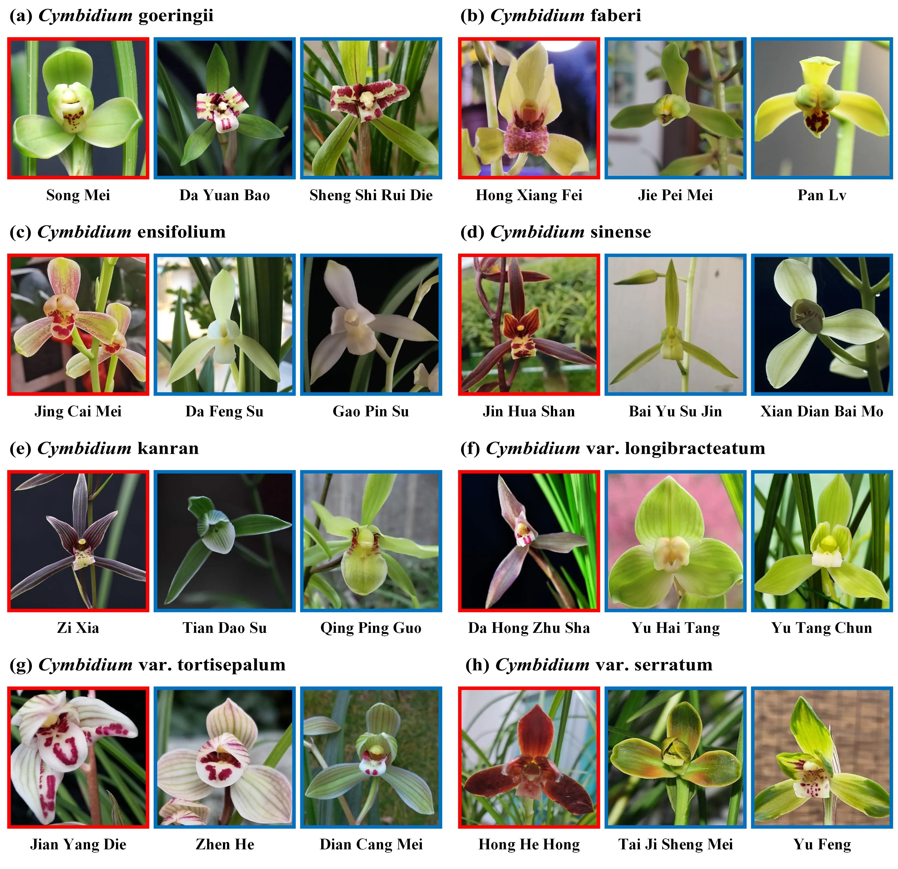

# Orchid2024: A Cultivar-Level Dataset and Methodology for Fine-Grained Classification of Chinese Cymbidium Orchids

## 🪴Dataset Outline

### Introduction

Orchid2024 is a fine-grained classification dataset specifically designed for Chinese Cymbidium orchid cultivars. It includes data collected from 20 cities across 12 provinces in China and encompasses 1,269 cultivars from 8 Chinese Cymbidium orchid species and 6 additional categories, totaling 156,630 images. The dataset covers nearly all common Chinese Cymbidium cultivars currently found in China, with its fine granularity and focus on the real world making it a unique and practical resource for researchers and practitioners. Our work introduced various visually parameter-efficient fine-tuning methods to expedite model development, achieving the highest top-1 accuracy of 86.14% and top-5 accuracy of 95.44%. The use of this dataset is permitted for non-commercial research and educational activities only.



### Download

~~The dataset can be downloaded via the following link: .~~ The dataset will be online no later than one month after the paper is published. Dataset preview reference: [Orchid2024-dataset-structure](https://pengyingshu.github.io/orchid/Orchid2024.html#_2-dataset-structure).

The dataset comprises training images, training information files, and data description files. The training images are divided into training, validation, and test sets in a ratio of 6:2:2, with specific training image structures outlined in [datesets/orchid2024](datasets/orchid2024). The training information files include train.json, val.json and test.json, generated by [datasets/create_json.py](datasets/create_json.py) for training model. The [`datesets/orchid2024/classes.csv`](./datasets/orchid2024/classes.csv) file contains the index and name for each cultivar within the Orchid2024 dataset. 


### Useful links

Research home page: [https://pengyingshu.github.io/orchid/Orchid2024](https://pengyingshu.github.io/orchid/Orchid2024).

## 🛠️Structure of The Repo

- `configs`: configuration file storage directory
- `datasets`: dataset storage directory
- `src/configs`: handles config parameters for the experiments
  * `src/config/config.py`: main config setups for experiments and explanation for each of them
- `src/data`: loading and setup input datasets
- `src/engine`: main training and eval actions here
- `src/models`: handles backbone archs and heads for different fine-tuning protocols 
    * `src/models/vit_prompt`: a folder contains the same backbones in `vit_backbones` folder, specified for VPT. This folder should contain the same file names as those in `vit_backbones`
    * `src/models/vit_models.py`: main model for transformer-based models
    * `src/models/build_model.py`: main action here to utilize the config and build the model to train / eval
- `src/solver`: optimization, losses and learning rate schedules
- `src/utils`: helper functions for io, loggings, training, visualizations
- `run.py`: call this one for training and eval a model with a specified transfer type

## 🖥️Code Usage

### Environment settings

Please refer to the [env_setup.sh](env_setup.sh) file or execute the command "pip install -r requirements.txt" to install all necessary dependencies.

System Requirements:

+ Supported operating systems: Ubuntu 18.08 LTS to 22.04 LTS
+ Supported python versions: 3.8 to 3.10
+ Windows systems compatibility notice: due to potential library reference issues, the Transformer model loading code may require adjustments to function correctly on Windows systems

### Dataset preparation

The Orchid dataset is stored in [datesets/orchid2024](datasets/orchid2024). For both the Orchid dataset and custom datasets, a corresponding training information file should be generated. Run the following Python code in the project root directory to generate the corresponding training information file in the Orchid2024 dataset directory:

```python
python dataset/create_json.py
```

Then, modify the DATA.DATAPATH item and DATA.NUMBER_CLASSES item in the configuration file. For information on how to modify the configuration document, please refer to [Config file description](#config-file-description).

### Pre-trained model preperation

**The project needs to load the pre-trained model by default**. The configuration file specifies DATA.FEATURE as the name of the pre-trained model. Based on this configuration, the pre-trained model is downloaded to the specified directory MODEL.MODEL_ROOT with a corresponding name. 

All the model links are obtained directly from official download repositories like [ViT](https://github.com/google-research/vision_transformer), [MAE](https://github.com/facebookresearch/mae) and [Swin](https://github.com/microsoft/Swin-Transformer).


**Please note that models downloaded from the "link" column require renaming of the "DATA.FEATURE" item according to the corresponding value in the "name" column**. Details as follows:

**ViT(Vision Transformer)**


By default, the DATA.FEATURE configuration is set to "sup_vitb16_imagenet21k", indicating the use of a pre-trained Vision Transformer (ViT)/B-16 model trained on the ImageNet-21K dataset. After downloading the pre-trained model to the default location specified by MODEL.MODEL_ROOT (typically model/pretrain). For models following the naming convention "sup_vitb16_imagenet21k", downloaded checkpoint files should be renamed from `ViT-B_16.npz` to `imagenet21k_ViT-B_16.npz` for correct identification and compatibility.

`ImageNet-21k pre-training`


|name|link|
|-|-|
|sup_vitb8_imagenet21k|https://storage.googleapis.com/vit_models/imagenet21k/ViT-B_8.npz|
|sup_vitb16_imagenet21k|https://storage.googleapis.com/vit_models/imagenet21k/ViT-B_16.npz|
|sup_vitb32_imagenet21k|https://storage.googleapis.com/vit_models/imagenet21k/ViT-B_32.npz|
|sup_vitl16_imagenet21k|https://storage.googleapis.com/vit_models/imagenet21k/ViT-L_16.npz|
|sup_vitl32_imagenet21k|https://storage.googleapis.com/vit_models/imagenet21k/ViT-L_32.npz|
|sup_vith14_imagenet21k|https://storage.googleapis.com/vit_models/imagenet21k/ViT-H_14.npz|

`ImageNet-21k pre-training/ImageNet-1k fine-tuning`

|name|link|
|-|-|
|sup_vitb8|https://storage.googleapis.com/vit_models/imagenet21k%2Bimagenet2012/ViT-B_8.npz|
|sup_vitb16|https://storage.googleapis.com/vit_models/imagenet21k%2Bimagenet2012/ViT-B_16.npz|
|sup_vitb16_224|https://storage.googleapis.com/vit_models/imagenet21k%2Bimagenet2012/ViT-B_16-224.npz|
|sup_vitb32|https://storage.googleapis.com/vit_models/imagenet21k%2Bimagenet2012/ViT-B_32.npz|
|sup_vitl16|https://storage.googleapis.com/vit_models/imagenet21k%2Bimagenet2012/ViT-L_16.npz|
|sup_vitl16_224|https://storage.googleapis.com/vit_models/imagenet21k%2Bimagenet2012/ViT-L_16-224.npz|
|sup_vitl32|https://storage.googleapis.com/vit_models/imagenet21k%2Bimagenet2012/ViT-L_32.npz|

**MAE(Masked Autoencoder)**

`Imagenet-1k pre-training`

|name|link|
|-|-|
|mae_vitb16|https://dl.fbaipublicfiles.com/mae/pretrain/mae_pretrain_vit_base.pth|
|mae_vitl16|https://dl.fbaipublicfiles.com/mae/pretrain/mae_pretrain_vit_large.pth|
|mae_vith14|https://dl.fbaipublicfiles.com/mae/pretrain/mae_pretrain_vit_huge.pth|

**Swin(Swin Transformer)**

`ImageNet-1k pre-training or ImageNet-21k(also called ImageNet-22k) pre-training`


|name|link|
|-|-|
|swint_imagenet|https://github.com/SwinTransformer/storage/releases/download/v1.0.0/swin_tiny_patch4_window7_224.pth|
|swins_imagenet|https://github.com/SwinTransformer/storage/releases/download/v1.0.0/swin_small_patch4_window7_224.pth|
|swinb_imagenet_224|https://github.com/SwinTransformer/storage/releases/download/v1.0.0/swin_base_patch4_window7_224.pth|
|swint_imagenet22k_224|https://github.com/SwinTransformer/storage/releases/download/v1.0.8/swin_tiny_patch4_window7_224_22k.pth|
|swins_imagenet22k_224|https://github.com/SwinTransformer/storage/releases/download/v1.0.8/swin_small_patch4_window7_224_22k.pth|
|swinb_imagenet22k_224|https://github.com/SwinTransformer/storage/releases/download/v1.0.0/swin_base_patch4_window7_224_22k.pth|
|swinl_imagenet22k_224|https://github.com/SwinTransformer/storage/releases/download/v1.0.0/swin_large_patch4_window7_224_22k.pth|


### Training command

After preparing the dataset and pre-trained model, execute the following command (single GPU only):

**training**

Run the code directly based on the yaml file:

```
python3 run.py --config-file configs/prompt/orchid_prompt_deep.yaml
```

Specify yaml file configuration parameters in the command:

```
python run.py --config-file configs/linear/orchid_linear.yaml \
                MODEL.TYPE "vit" \
                DATA.FEATURE "sup_vitb16_imagenet21k"
```

**eval**

```
python run.py --eval --eval-dataset 'test' --config-file \
                configs/finetune/orchid_lora.yaml \
                MODEL.LORA.TUNE_KEY True MODEL.LORA.TUNE_OUT True \
                MODEL.WEIGHT_PATH <path>/best_model.pth
```

## 📑Config File Description

Build diverse models by adjusting various parameters in the configuration file. All the following parameters can be modified within the respective yaml file or specified as runtime parameters while executing the training code.


### General configuration

- Base configuration
  - \_BASE\_: path to the base configuration file
  - OUTPUT_DIR: output directory
  - SEED: random seed
- Data configuration
  - DATA.NAME: name of the Python dataclass used to read image data, rather than the dataset name
  - DATA.DATAPATH: directory location of the datasets
  - DATA.NUMBER_CLASSES: mumber of dataset categories
  - DATA.FEATURE: specify which representation to use
  - DATA.CROPSIZE = 224  # or 384
  - DATA.BATCH_SIZE: batch size
- Model configuration
  - MODEL.TRANSFER_TYPE: fine-tuning method specification
  - MODEL.TYPE: the general backbone type, e.g., "vit" or "ssl-vit"
  - MODEL.MODEL_ROOT: folder with pre-trained model checkpoints
  - MODEL.SAVE_CKPT: if set to True, will save model ckpts and final output of both val and test set
  - MODEL.WEIGHT_PATH: path to the model weight file, usually used to test model accuracy
- Solver configuration
  - SOLVER.BASE_LR: initial learning rate for the experiment
  - SOLVER.WARMUP_EPOCH: number of warm-up epochs
  - SOLVER.WEIGHT_DECAY: weight decay value for the experiment


### transfer_type configuration


**Full-parameter fine-tuning(end2end)**

> configs/finetune/orchid_finetune.yaml

update all backbone and classification head parameters

- MODEL.TRANSFER_TYPE "end2end"

**Linear**

> configs/linear/orchid_linear.yaml

employ a linear layer as the classification head and solely update its parameters

- MODEL.TRANSFER_TYPE "linear"

**Partial-k**

> configs/finetune/orchid_partial1.yaml
> configs/finetune/orchid_partial2.yaml

fine-tune the last k layers of the backbone while freezing the others

- MODEL.TRANSFER_TYPE "partial-1"/"partial-2"/"partial-4"

**Prompt**

> configs/prompt/orchid_prompt_deep.yaml
> configs/prompt/orchid_prompt_shallow.yaml

visual prompt tuning

- MODEL.TRANSFER_TYPE "prompt"
  - MODEL.PROMPT.DEEP: prompt length
  - MODEL.PROMPT.NUM_TOKENS: deep or shallow prompt
  - MODEL.PROMPT.DROPOUT: the dropout rate to be used in the prompt

**MLP-k**

employ a multilayer perceptron (MLP) with k layers as the classification head, in place of a linear layer.

- MODEL.TRANSFER_TYPE "linear"
  - MODEL.MLP_NUM: number of layers in the MLP excluding the classification head

**Side tuning(side)**

> configs/linear/orchid_side.yaml

Train a "side" network(e.g., AlexNet) and linearly interpolate between pre-trained features and side features to generate a new vector which is fed into the classification head.

- MODEL.TRANSFER_TYPE "side"

**Bias tuning(tinytl-bias)**

> configs/finetune/orchid_tinytl-bias.yaml

fine-tune only the bias modules of the backbone

- MODEL.TRANSFER_TYPE "tinytl-bias"

**Adapter**

> configs/finetune/orchid_adapter.yaml

insert new MLP modules with residual connection inside Transformer layers

- MODEL.TRANSFER_TYPE "adapter"
  - MODEL.ADAPTER.REDUCATION_FACTOR: defines the ratio between a model’s layer hidden dimension and the bottleneck dimension

**LoRA**

> configs/finetune/orchid_lora.yaml

introduce low rank adaptation to each attention module for Vision Transformer

- MODEL.TRANSFER_TYPE "lora"
  - RANK: rank of lora
  - TUNE_QUERY: whether to add the key weight to lora
  - TUNE_VALUE: whether to add the value weight to lora
  - TUNE_KEY: whether to add the tune weight to lora
  - TUNE_OUT: whether to add the projection linear layer weight to lora

### Backbone choice

We can select the desired model architecture by specifying MODEL.TYPE and opt for different variations of the model by utilizing DATA.FEATURE.


**ViT-B**

- MODEL.TYPE "vit"
- DATA.FEATURE "sup_vitb16_imagenet21k"

**MAE**

- MODEL.TYPE "ssl-vit"
- DATA.FEATURE "mae_vitb16"

**Swin-B**
- MODEL.TYPE "swin"
- DATA.FEATURE "swinb_imagenet22k_224"

**ResNet50**

- MODEL.TYPE "resnet"
- DATA.FEATURE "imagenet_sup_rn50"
- MODEL.PROMPT.LOCATION "pad"
- MODEL.PROMPT.NUM_TOKENS "5"


## 👍Acknowledgements

We utilize code derived from [VPT](https://github.com/KMnP/vpt) and [LoRA-ViT](https://github.com/JamesQFreeman/LoRA-ViT), and extend our gratitude to the authors for sharing their work.